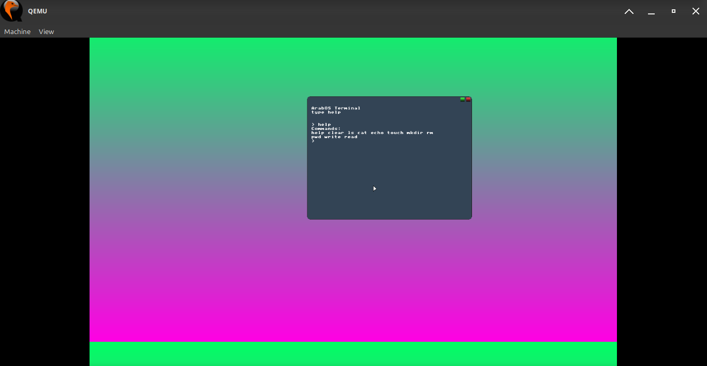

  

#  نظام العرب (Arab OS) 🌙️⚔️

  

## المشروع :
* الرخصة : جنو العمومية الاصدار 2   , 2.GPL V.
* المشروع : نظام تشغيل 64بايت.
* اسم المشروع : نظام العرب.
* المطور : سيف حسين.
* الاصدار : 4 الرابع (تاريخ الاصدار : 27 من ذو القعده 1447هـ).
* النوع : نظام تشغيل (64bit).
* لغة البناء : السي c.
---

### 🚀 كيفية البناء

`makeنفذ الامر  `
`make run للبناء والتشغيل نفذ الامر  `

---

## قال ﷺ:
* «إِذَا مَاتَ ابنُ آدم انْقَطَعَ عَنْهُ عَمَلُهُ إِلَّا مِنْ ثَلَاثٍ: صَدَقَةٍ جَارِيَةٍ، أَوْ عِلْمٍ يُنْتَفَعُ بِهِ، أَوْ وَلَدٍ صَالِحٍ يَدْعُو لَهُ» (رواه مسلم).

